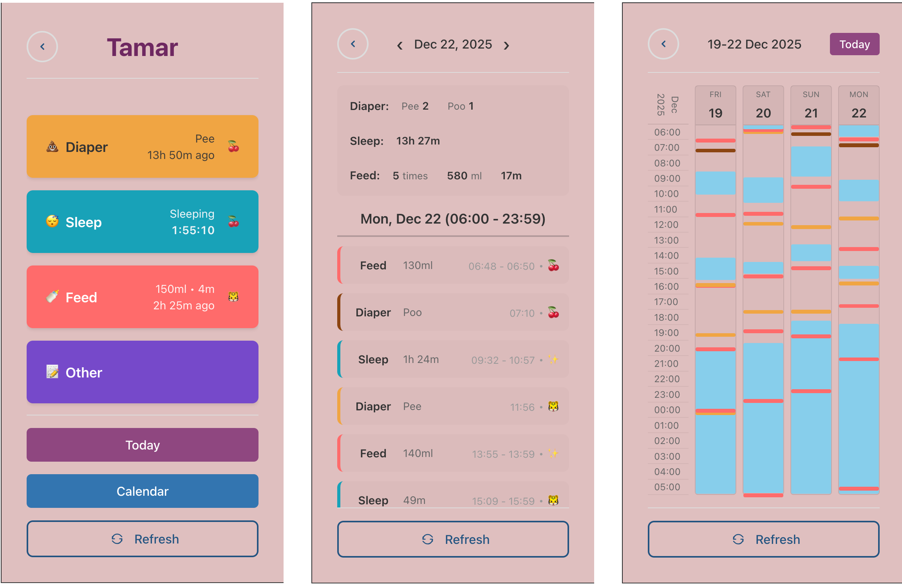

# Baby Tracker

A web application for tracking baby activities including feeding, sleeping, diaper changes, and other daily routines. This project is inspired by [Huckleberry](https://huckleberrycare.com/) but has been customized with personalized features and behaviors.

## 🌐 Production

**Live Application:** [https://baby-tracker.up.railway.app/](https://baby-tracker.up.railway.app/)

## 🎯 Project Description

Baby Tracker is a full-stack application that helps caregivers monitor and log baby activities throughout the day. The application supports multiple users, allowing family members and caregivers to collaborate in tracking a baby's daily routine.

## ✨ Custom Features

This application includes several customizations beyond the original Huckleberry inspiration:

- **Multi-User Support**: Multiple users can log in and track activities for shared baby profiles
- **User Emoji Identification**: Each user's emoji appears next to actions they've logged, making it easy to see who recorded what
- **Enhanced Feeding Tracking**: 
  - Record bottle feeding start and end times
  - Add milliliters (ml) consumed at the end of feeding sessions
- **Incomplete Action Reports**: View unfinished actions in reports to track ongoing activities
- **iPad-Optimized View**: Responsive design optimized for iPad viewing and interaction

## 🏗️ Project Structure

This is a monorepo containing:

- **`client/`** - React frontend application (see [client/README.md](./client/README.md))
- **`server/`** - Express.js backend API (see [server/README.md](./server/README.md))

## 🚀 Getting Started

### Prerequisites

- Node.js (>= 18.0.0)
- MongoDB database
- Google OAuth credentials (for authentication)

### Installation

1. Clone the repository
2. Set up the server (see [server/README.md](./server/README.md))
3. Set up the client (see [client/README.md](./client/README.md))

